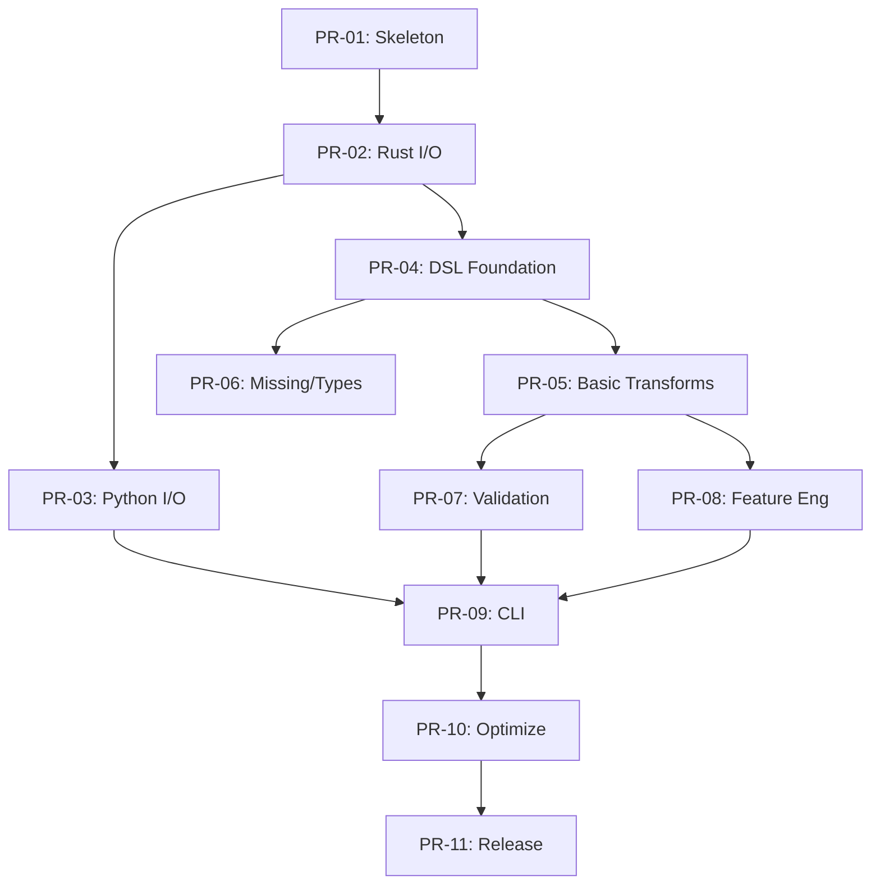

# mlprep Project Plan & Roadmap

**For detailed specifications, see [SPEC.md](SPEC.md).**

---

## Why mlprep?

| Need | Current Solution | mlprep Advantage |
|------|------------------|------------------|
| Fast ETL | Polars (requires Python code) | YAML config, no code required |
| Data Validation | Great Expectations (complex setup) | Simpler, faster, quarantine mode |
| Feature Engineering | Custom scripts (fragile) | Declarative, reproducible fit/transform |
| CI/CD Integration | Complex pipelines | Single `mlprep run pipeline.yaml` |
| Train/Test Consistency | Manual state management | Built-in FeatureState persistence |

**Core Differentiators:**
1. **YAML-first Pipeline**: Standard ETL + validation + features without writing code.
2. **Quarantine Mode**: Bad rows are isolated to separate files, not just logged.
3. **Single Binary CLI**: Run pipelines in CI/CD without Python environment setup.

---

## Risks & Mitigations

| Risk | Impact | Likelihood | Mitigation |
|------|--------|------------|------------|
| Polars API breaking change | High | Low | Pin version in `Cargo.toml`, monitor changelog |
| Performance target (1GB < 5s) not met | Medium | Medium | Profile early (PR-02), adjust targets if needed |
| Feature creep delays MVP | Medium | Medium | Strict MVP scope, defer Phase 2 items |
| PyO3 compatibility issues | Medium | Low | Use stable PyO3 version, test on multiple Python versions |

---

# Implementation Roadmap

MVP (Phase 1) を確実にリリースするための、Pull Request (PR) 単位のタスク分割。

## Phase 1.0: Foundation & Setup

### PR-01: Project Skeleton & CI Setup `[MVP]`
* **Goal**: Rust/Pythonの混合プロジェクト構造の確立とCIの疎通。
* **Tasks**:
  * `cargo new mlprep` (workspace)
  * `pyproject.toml` (maturin)
  * GitHub Actions: `cargo test`, `cargo clippy`, `cibuildwheel` (dry-run)
  * EditorConfig, Pre-commit hooks (ruff, rustfmt)
* **Verify**: CIがGreenになること。`import mlprep` がエラーなく通ること（空モジュール）。

### PR-02: Core I/O & Polars Integration `[MVP]`
* **Goal**: Rust側でPolarsを呼び出し、CSV/Parquetの読み書きができる。
* **Deps**: PR-01
* **Tasks**:
  * `src/engine.rs`: `LazyFrame` ラッパーの実装
  * `io` モジュール: `read_csv`, `read_parquet`, `write_parquet`
  * Unit Tests: 小規模CSVの読み書きテスト
  * **Benchmark Script**: `scripts/benchmark.py` を作成（後続PRで継続利用）
  * **Early Performance Check**: 1GB CSV読み込みの初期ベンチマーク
* **Verify**: RustのユニットテストでI/Oが動作確認できる。ベンチマークスクリプトで基準値を取得。

## Phase 1.1: Python Binding & Basic API

### PR-03: Python I/O Bindings `[MVP]`
* **Goal**: Pythonから `mlprep.read_csv` を実行可能にする。
* **Deps**: PR-02
* **Tasks**:
  * PyO3: `PyDataFrame` クラスの定義
  * `mlprep.read_csv` -> Rust `engine::read_csv` へのバインディング
  * Python Tests: `pytest` でCSV読み込みテスト
* **Verify**: `python -c "import mlprep; df = mlprep.read_csv('test.csv')"` が動く。

### PR-04: Transform DSL Foundation `[MVP]`
* **Goal**: YAMLで定義された変換ルールをパースし、Polars Exprに変換する。
* **Deps**: PR-02
* **Tasks**:
  * `src/dsl.rs`: YAML構造体定義 (`serde`)
  * `src/compute.rs`: DSL -> Polars Expr 変換 (Cast, Filter, Select)
  * `engine::apply_transforms`: `LazyFrame` に一連のExprを適用
* **Verify**: Rustテストで YAML 文字列をパースし、DataFrameが変換されるか確認。

## Phase 1.2: Core Features Implementation

### PR-05: Basic Transforms (Join, GroupBy, Window) `[MVP]`
* **Goal**: 基本的なETL操作の実装。
* **Deps**: PR-04
* **Tasks**:
  * DSL拡張: `join`, `groupby`, `window`, `sort`
  * Polars APIとのマッピング実装
  * Edge Case Tests: キー不在時のJoin挙動など
* **Verify**: 複雑な集計クエリを含む統合テストパス。

### PR-06: Handling Missing Values & Types `[MVP]`
* **Goal**: 欠損値処理と型変換の強化。
* **Deps**: PR-04
* **Tasks**:
  * DSL拡張: `fillna` (strategy pattern), `dropna`
  * 型推論コンフィグの実装 (`schema` オプション)
  * `dsl::Schema` 定義とバリデーション
* **Verify**: 欠損を含むデータで指定通りに補完・削除されるか。

### PR-07: Validation Engine `[MVP]`
* **Goal**: データ品質チェック機能の実装。
* **Deps**: PR-05
* **Tasks**:
  * `src/validate.rs`: Checkロジック実装 (NotNull, Unique, Range)
  * `ValidationResult` 構造体とレポート生成
  * `quarantine` モードの実装（違反行の分離出力）
* **Verify**: 不正データを含むCSVを食わせて、エラーレポートと隔離ファイルが出力されるか。

## Phase 1.3: Feature Engineering & CLI

### PR-08: Feature Engineering DSL `[MVP]`
* **Goal**: 特徴量生成（FeatureSet）のサポート。
* **Deps**: PR-05
* **Tasks**:
  * `features` モジュール: `fit` / `transform` traitの設計
  * 実装: Scaling (MinMax, Standard), Encoding (OneHot, Count)
  * `feature_state.json` の保存・読み込みロジック
* **Verify**: Trainデータでfitし、Testデータでtransformした結果が整合しているか。

### PR-09: CLI "run" Command `[MVP]`
* **Goal**: コマンドラインからパイプライン全体を実行する。
* **Deps**: PR-03, PR-04, PR-07, PR-08
* **Tasks**:
  * `clap`: `mlprep run <pipeline.yaml>` の実装
  * 全コンポーネントの統合（I/O -> Transform -> Validate -> Features -> Write）
  * ログ出力 (tracing/log) と進捗表示 (indicatif)
* **Verify**: エンドツーエンドのシナリオテスト（CLIのみで完結）。

## Phase 1.4: Optimization & Release

### PR-10: Benchmarking & Optimization `[MVP-Optional]`
* **Goal**: 目標性能（CSV 1GB < 5s）の達成確認とチューニング。
* **Deps**: PR-09
* **Tasks**:
  * ベンチマークスクリプト拡張 (`scripts/benchmark.py`)
    * 計測対象: CSV読み込み、Parquet読み込み、GroupBy、Join、書き出し
    * 出力形式: Markdown / JSON
  * `jemalloc` 導入検討
  * Polars設定チューニング (streaming toggle, thread pool)
  * 性能退行検知用のCI統合（オプション）
* **Verify**: `docs/BENCHMARK.md` に結果を記録。目標未達なら原因調査・修正。
* **Note**: Alpha版リリースは基本機能動作でOK。パフォーマンスは継続改善。

### PR-11: Documentation & Release `[MVP]`
* **Goal**: v0.1.0-alpha リリース。
* **Deps**: PR-10
* **Tasks**:
  * API Docs 生成 (pdoc / rustdoc)
  * `README.md` 更新（Getting Started）
  * CI: Release Workflow (Tag push -> PyPI upload)
* **Verify**: PyPIから `pip install mlprep` して動くこと。

---

## Task Dependency Graph

---

## MVP Completion Criteria

- [ ] All `[MVP]` PRs merged
- [ ] Benchmark: CSV 1GB read < 5s (8 threads, SSD)
- [ ] Test coverage: 80%+
- [ ] PyPI alpha release published
- [ ] README with quickstart guide
