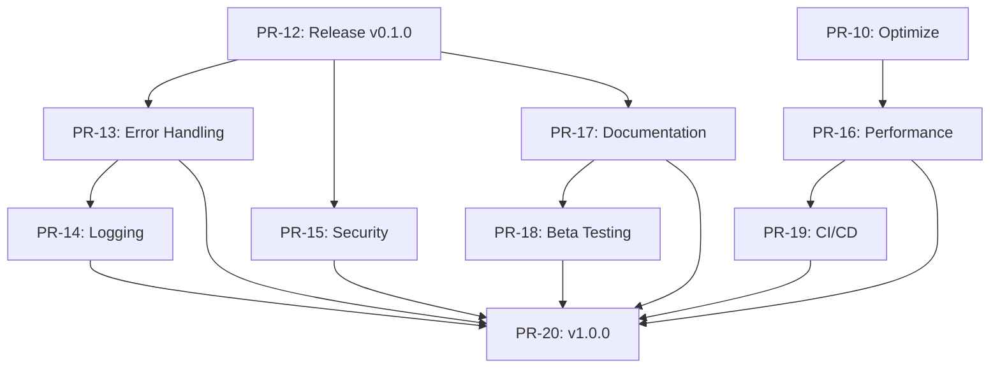
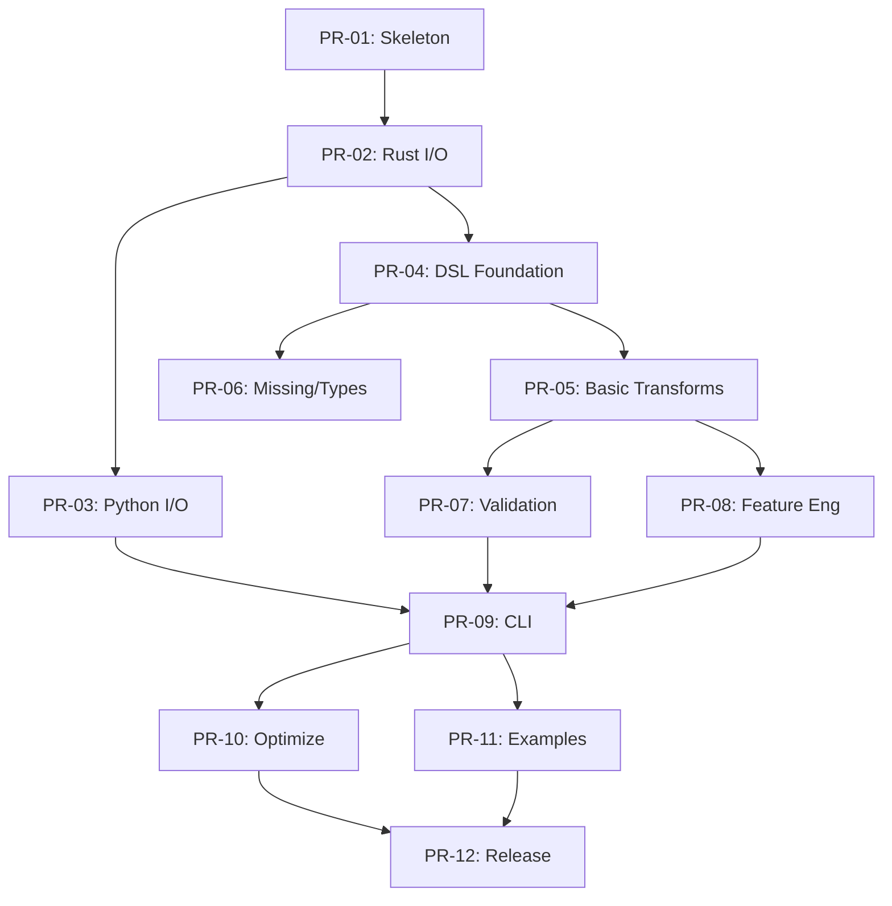

# mlprep Project Plan & Roadmap

**For detailed specifications, see [SPEC.md](SPEC.md).**

---

## Why mlprep?

| Need | Current Solution | mlprep Advantage |
|------|------------------|------------------|
| Fast ETL | Polars (requires Python code) | YAML config, no code required |
| Data Validation | Great Expectations (complex setup) | Simpler, faster, quarantine mode |
| Feature Engineering | Custom scripts (fragile) | Declarative, reproducible fit/transform |
| CI/CD Integration | Complex pipelines | Single `mlprep run pipeline.yaml` |
| Train/Test Consistency | Manual state management | Built-in FeatureState persistence |

**Core Differentiators:**
1. **YAML-first Pipeline**: Standard ETL + validation + features without writing code.
2. **Quarantine Mode**: Bad rows are isolated to separate files, not just logged.
3. **Single Binary CLI**: Run pipelines in CI/CD without Python environment setup.

---

## Competitive Analysis

### Target Users

| Target Segment | Pain Point | mlprep Value Proposition |
|----------------|------------|-------------------------|
| Small-Mid ML Teams | Feature Store導入は過剰だが再現性は必要 | 軽量で追加インフラ不要 |
| CI/CD Pipelines | Python環境なしでデータ検証したい | Single Binary CLI |
| pandas → Polars移行者 | 移行の学習コストが高い | 宣言的YAML設定 |

### Competitor Comparison

| Tool | Strength | mlprep Advantage |
|------|----------|------------------|
| **Polars** | Fastest DataFrame | YAML-first + Validation統合 |
| **Great Expectations** | Powerful validation rules | Lightweight, Quarantine mode |
| **dbt** | SQL-first ELT | Non-SQL use cases, Feature eng |
| **Feast** | Production Feature Store | Local-first, No infra required |
| **pandas** | Ubiquity | 3-30x faster |

### Concerns & Mitigation

| Concern | Risk | Mitigation |
|---------|------|------------|
| Polarsが類似機能を追加 | 中 | Lineage+Quarantine統合で差別化 |
| 市場がdbt+GE+Feastで既に解決済み | 高 | 軽量・ローカル完結を訴求 |
| 新しいDSL学習コスト | 中 | pandas互換モードと移行ガイド |

---

## Differentiation Roadmap (Phase 2+)

### D-01: Quarantine + Lineage Integration
* **Goal**: 「なぜこの行が除外されたか」の完全トレース
* **Features**:
  * `quarantine_lineage.json`: 違反行ごとのルールID、入力ソース、タイムスタンプ
  * HTML/Markdownでの可視化レポート
  * CI/CDでの自動アラート連携

### D-02: Feature Store Integration
* **Goal**: Feast/Tecton等への出力形式対応
* **Features**:
  * Feast FeatureView形式でのエクスポート
  * Feature Registry JSONの生成
  * オンライン/オフライン特徴量の統合管理

### D-03: pandas Migration Mode
* **Goal**: 既存ユーザーの移行ハードルを下げる
* **Features**:
  * pandas互換APIラッパー(`mlprep.compat.pandas`)
  * 自動変換ツール（pandasコード → mlprep YAML）
  * 移行ガイドドキュメント

---

## Risks & Mitigations

| Risk | Impact | Likelihood | Mitigation |
|------|--------|------------|------------|
| Polars API breaking change | High | Low | Pin version in `Cargo.toml`, monitor changelog |
| Performance target (1GB < 5s) not met | Medium | Medium | Profile early (PR-02), adjust targets if needed |
| Feature creep delays MVP | Medium | Medium | Strict MVP scope, defer Phase 2 items |
| PyO3 compatibility issues | Medium | Low | Use stable PyO3 version, test on multiple Python versions |

---

# Implementation Roadmap

MVP (Phase 1) を確実にリリースするための、Pull Request (PR) 単位のタスク分割。

## Phase 1.0: Foundation & Setup

### PR-01: Project Skeleton & CI Setup `[DONE]`
* **Goal**: Rust/Pythonの混合プロジェクト構造の確立とCIの疎通。
* **Tasks**:
  * `cargo new mlprep` (workspace)
  * `pyproject.toml` (maturin)
  * GitHub Actions: `cargo test`, `cargo clippy`, `cibuildwheel` (dry-run)
  * EditorConfig, Pre-commit hooks (ruff, rustfmt)
* **Verify**: CIがGreenになること。`import mlprep` がエラーなく通ること（空モジュール）。

### PR-02: Core I/O & Polars Integration `[DONE]`
* **Goal**: Rust側でPolarsを呼び出し、CSV/Parquetの読み書きができる。
* **Deps**: PR-01
* **Tasks**:
  * `src/engine.rs`: `LazyFrame` ラッパーの実装
  * `io` モジュール: `read_csv`, `read_parquet`, `write_parquet`
  * Unit Tests: 小規模CSVの読み書きテスト
  * **Benchmark Script**: `scripts/benchmark.py` を作成（後続PRで継続利用）
  * **Early Performance Check**: 1GB CSV読み込みの初期ベンチマーク
* **Verify**: RustのユニットテストでI/Oが動作確認できる。ベンチマークスクリプトで基準値を取得。

## Phase 1.1: Python Binding & Basic API

### PR-03: Python I/O Bindings `[DONE]`
* **Goal**: Pythonから `mlprep.read_csv` を実行可能にする。
* **Deps**: PR-02
* **Tasks**:
  * PyO3: `PyDataFrame` クラスの定義
  * `mlprep.read_csv` -> Rust `engine::read_csv` へのバインディング
  * Python Tests: `pytest` でCSV読み込みテスト
* **Verify**: `python -c "import mlprep; df = mlprep.read_csv('test.csv')"` が動く。

### PR-04: Transform DSL Foundation `[DONE]`
* **Goal**: YAMLで定義された変換ルールをパースし、Polars Exprに変換する。
* **Deps**: PR-02
* **Tasks**:
  * `src/dsl.rs`: YAML構造体定義 (`serde`)
  * `src/compute.rs`: DSL -> Polars Expr 変換 (Cast, Filter, Select)
  * `engine::apply_transforms`: `LazyFrame` に一連のExprを適用
* **Verify**: Rustテストで YAML 文字列をパースし、DataFrameが変換されるか確認。

## Phase 1.2: Core Features Implementation

### PR-05: Basic Transforms (Join, GroupBy, Window) `[DONE]`
* **Goal**: 基本的なETL操作の実装。
* **Deps**: PR-04
* **Tasks**:
  * DSL拡張: `join`, `groupby`, `window`, `sort`
  * Polars APIとのマッピング実装
  * Edge Case Tests: キー不在時のJoin挙動など
* **Verify**: 複雑な集計クエリを含む統合テストパス。

### PR-06: Handling Missing Values & Types `[DONE]`
* **Goal**: 欠損値処理と型変換の強化。
* **Deps**: PR-04
* **Tasks**:
  * DSL拡張: `fillna` (strategy pattern), `dropna`
  * 型推論コンフィグの実装 (`schema` オプション)
  * `dsl::Schema` 定義とバリデーション
* **Verify**: 欠損を含むデータで指定通りに補完・削除されるか。

### PR-07: Validation Engine `[DONE]`
* **Goal**: データ品質チェック機能の実装。
* **Deps**: PR-05
* **Tasks**:
  * `src/validate.rs`: Checkロジック実装 (NotNull, Unique, Range)
  * `ValidationResult` 構造体とレポート生成
  * `quarantine` モードの実装（違反行の分離出力）
* **Verify**: 不正データを含むCSVを食わせて、エラーレポートと隔離ファイルが出力されるか。

## Phase 1.3: Feature Engineering & CLI

### PR-08: Feature Engineering DSL `[DONE]`
* **Goal**: 特徴量生成（FeatureSet）のサポート。
* **Deps**: PR-05
* **Tasks**:
  * `features` モジュール: `fit` / `transform` traitの設計
  * 実装: Scaling (MinMax, Standard), Encoding (OneHot, Count)
  * `feature_state.json` の保存・読み込みロジック
* **Verify**: Trainデータでfitし、Testデータでtransformした結果が整合しているか。

### PR-09: CLI "run" Command `[DONE]`
* **Goal**: コマンドラインからパイプライン全体を実行する。
* **Deps**: PR-03, PR-04, PR-07, PR-08
* **Tasks**:
  * `clap`: `mlprep run <pipeline.yaml>` の実装
  * 全コンポーネントの統合（I/O -> Transform -> Validate -> Features -> Write）
  * ログ出力 (tracing/log) と進捗表示 (indicatif)
* **Verify**: エンドツーエンドのシナリオテスト（CLIのみで完結）。

## Phase 1.4: Optimization & Release

### PR-10: Benchmarking & Optimization `[DONE]`
* **Goal**: 目標性能（CSV 1GB < 5s）の達成確認とチューニング。
* **Deps**: PR-09
* **Tasks**:
  * ベンチマークスクリプト拡張 (`scripts/benchmark.py`)
    * 計測対象: CSV読み込み、Parquet読み込み、GroupBy、Join、書き出し
    * 出力形式: Markdown / JSON
  * `jemalloc` 導入検討
  * Polars設定チューニング (streaming toggle, thread pool)
  * 性能退行検知用のCI統合（オプション）
* **Verify**: `docs/BENCHMARK.md` に結果を記録。目標未達なら原因調査・修正。
* **Note**: Alpha版リリースは基本機能動作でOK。パフォーマンスは継続改善。

### PR-11: Examples & Use Cases `[DONE]`
* **Goal**: ユーザーが主要なユースケースを素早く理解できるサンプル集を提供。
* **Deps**: PR-09
* **Tasks**:
  * `examples/` フォルダ作成
  * **基本例**:
    * `01_basic_etl/` - CSV読み込み → フィルタ → Parquet出力
    * `02_data_validation/` - スキーマ検証 + quarantineモード
    * `03_feature_engineering/` - fit/transform による特徴量生成
  * **ツール連携例**:
    * `04_scikit_learn_integration/` - mlprep → scikit-learn パイプライン
    * `05_mlflow_experiment/` - MLflow実験でのデータ前処理
    * `06_airflow_dag/` - Airflow DAGでのmlprep CLI呼び出し
    * `07_dvc_pipeline/` - DVC パイプラインとの統合
  * 各例に `README.md`, `pipeline.yaml`, サンプルデータ, 実行スクリプトを含む
* **Verify**: 各exampleが `mlprep run` で正常動作すること。

### PR-12: Documentation & Release `[DONE]`
* **Goal**: v0.1.0-alpha リリース。
* **Deps**: PR-11
* **Tasks**:
  * API Docs 生成 (pdoc / rustdoc)
  * `README.md` 更新（Getting Started）
  * CI: Release Workflow (Tag push -> PyPI upload)
* **Verify**: PyPIから `pip install mlprep` して動くこと。

---

## Phase 2: Production Readiness

本番環境での利用を見据えた品質強化フェーズ。

### PR-13: Error Handling & User Experience `[DONE]`
* **Goal**: エラーメッセージの改善とユーザー体験の向上。
* **Deps**: PR-12
* **Tasks**:
  * エラーコード体系の整備（`MLPREP-E001`形式）
  * ユーザーフレンドリーなエラーメッセージ（原因＋解決策の提示）
  * YAML構文エラー時の行番号・カラム表示
  * `--verbose` / `--quiet` フラグの実装
  * カラー出力対応（`colored` crate）
* **Verify**: 主要なエラーパターンで適切なメッセージが表示されること。

### PR-14: Logging & Observability `[DONE]`
* **Goal**: 本番運用に必要なログ・メトリクス基盤の整備。
* **Deps**: PR-13
* **Tasks**:
  * 構造化ログ出力（JSON形式）：`--log-format json`
  * ログレベル制御（`MLPREP_LOG`環境変数）
  * 処理メトリクス出力（行数、処理時間、メモリ使用量）
  * `trace_id` / `run_id` の自動付与
  * `lineage.json` 出力（入力ファイルハッシュ、環境情報、ステップ履歴）
* **Verify**: 1パイプライン実行で完全なトレース情報が出力されること。

### PR-15: Security Hardening `[DONE]`
* **Goal**: セキュリティリスクの軽減。
* **Deps**: PR-12
* **Tasks**:
  * 入力パスのサンドボックス化（`--allowed-paths`オプション）
  * Regexタイムアウト制限（DoS対策）
  * 依存クレートの脆弱性スキャン（`cargo-audit` CI統合）
  * YAML爆弾対策（最大ネスト深度・サイズ制限）
  * 機密データのログマスキング（`--mask-columns`）
* **Verify**: `cargo audit` でCritical/High脆弱性ゼロ。

### PR-16: Performance Optimization `[DONE]`
* **Goal**: 大規模データでの安定動作と性能保証。
* **Deps**: PR-10
* **Tasks**:
  * Streaming処理モード（メモリに収まらないデータ対応）
  * メモリ使用量上限設定（`--memory-limit`）
  * `jemalloc` / `mimalloc` の選択的利用
  * Polars Lazy評価の最適化（predicate pushdown確認）
  * 10GBデータでのベンチマーク追加
* **Verify**: 10GBデータを16GBメモリ環境で処理可能。

### PR-17: Comprehensive Documentation `[DONE]`
* **Goal**: 新規ユーザーがセルフサービスで使い始められるドキュメント。
* **Deps**: PR-12
* **Tasks**:
  * **Getting Started Guide**: 5分で動くチュートリアル
  * **Pipeline YAML Reference**: 全オプションの詳細説明
  * **Migration Guide**: pandas → mlprep 移行手順
  * **Troubleshooting Guide**: よくあるエラーと解決策
  * **API Reference**: Python API (`pdoc`) と CLI (`--help` の充実)
  * **Video/GIF**: 30秒デモ動画
* **Verify**: 初見ユーザーがドキュメントのみで基本パイプラインを構築できること。

### PR-18: Beta Testing Program `[TODO]`
* **Goal**: 実ユーザーからのフィードバック収集。
* **Deps**: PR-17
* **Tasks**:
  * ベータテスター募集（3〜5名）
  * フィードバック収集テンプレート作成
  * Issue triageプロセスの確立
  * 週次フィードバックミーティング（2週間）
  * Critical issueの修正
* **Verify**: ベータテスターが実業務で1パイプラインを運用完了。

### PR-19: CI/CD Hardening `[TODO]`
* **Goal**: リリースプロセスの自動化と品質ゲート強化。
* **Deps**: PR-16
* **Tasks**:
  * テストカバレッジ計測（`tarpaulin` / `coverage.py`）
  * カバレッジ閾値チェック（80%未満でCI失敗）
  * 性能退行検知（ベンチマーク結果の自動比較）
  * Semantic Release自動化（Changelog生成）
  * PyPIへの自動publish（タグpush時）
  * GitHub Releasesへのバイナリアップロード
* **Verify**: `git tag v0.2.0` で自動リリース完了。

### PR-21: Streaming & Benchmark Improvements `[DONE]`
* **Goal**: Streaming継続性とベンチマーク訴求力の向上。
* **Deps**: PR-16
* **Tasks**:
  * **Lazy化**: `apply_validate` / `apply_features` での強制 `collect` を廃止し、`collect(streaming)` または Lazy Expr で組み立てることで streaming を維持。
  * **検証/隔離の Lazy 最適化**: 違反マスク生成を Lazy で行い、predicate pushdown や列プルーニングが効く形にする。
  * **特徴量ステップの Lazy 化**: スケーリング/エンコードを可能な範囲で Lazy Expr に寄せ、collect 回数を削減。
  * **CLIオーバーヘッド低減**: Rustバイナリ直叩き/複数パイプライン連続実行など、起動コストの影響を抑える仕組みを検討・実装。
  * **スレッド/メモリ設定露出**: `RuntimeConfig` の threads/cache、`POLARS_MAX_THREADS` などをCLI/ドキュメントから明示設定できるようにし、安定した計測条件を提供。
  * **ベンチマーク拡充**: 1GB以上の `--showcase` ワークロード（検証+特徴量込み、Rows/s 表示、pandas比較）をデフォルトシナリオに追加し、`docs/BENCHMARK.md` を更新。
  * **実装メモ**: CLIの複数パイプライン実行、`POLARS_MAX_THREADS`/`POLARS_CACHE` の制御、ショーケースベンチの拡充を反映。
* **Verify**: streaming 有効時に検証/特徴量ステップで collect が発生せず、1GBショーケースベンチで throughput 改善を確認。`docs/BENCHMARK.md` に新シナリオと結果が反映されている。

### PR-20: v1.0.0 Stable Release `[TODO]`
* **Goal**: 本番運用可能な安定版リリース。
* **Deps**: PR-13〜PR-19
* **Tasks**:
  * 全PRのマージ確認
  * CHANGELOG.md 最終更新
  * Breaking changes有無の確認とマイグレーションガイド
  * v1.0.0タグ作成・リリース
  * アナウンス（README、Twitter/X、Hacker News等）
* **Verify**: `pip install mlprep==1.0.0` で本番利用開始可能。

---

## Phase 2 Dependency Graph

---

## Phase 2 Completion Criteria

- [ ] All `[TODO]` PRs in Phase 2 merged
- [ ] Test coverage: 80%+
- [ ] Zero Critical/High vulnerabilities
- [ ] 10GB benchmark passing
- [ ] 3+ beta testers completed real pipeline
- [ ] v1.0.0 published to PyPI

---

## Task Dependency Graph

---

## MVP Completion Criteria

- [ ] All `[MVP]` PRs merged
- [ ] Benchmark: CSV 1GB read < 5s (8 threads, SSD)
- [ ] Test coverage: 80%+
- [ ] PyPI alpha release published
- [ ] README with quickstart guide

---

## Success Metrics (Post-MVP)

| Metric | Target | Measurement |
|--------|--------|-------------|
| GitHub Stars | 500+ (6 months) | Monthly tracking |
| PyPI Downloads | 1000/week | pypistats |
| Issue Response Time | < 48h | GitHub metrics |
| Benchmark vs pandas | 5x+ faster | CI benchmark suite |
